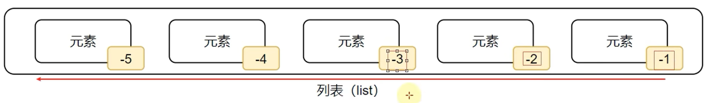

# day1010

## 一、type() 的使用

### 1、基本使用方式

```python
# 查看数据类型
# print(type("哈哈"))
# print(type(11))
# print(type(11.8))

# 将数据类型信息赋值给变量
# string_type = type("哈哈")
# int_type = type(11)
# float_type = type(11.8)

name = "hh"
print(type(name))
name = 11
print(type(name))
```

> python 中变量是没有类型的，变量存储的数据有类型。

执行 11-14 行代码，得到以下结果：

```
<class 'str'>
<class 'int'>
```

## 二、数据类型转换

### 1、基本使用方法

```python
print(int(11.4))
print(float(11))
print(type(str(11)))
```

## 三、python 中的标识符

### 1、命名规则

- 标识符中只允许出现英文、数字、下划线。

- 不能用数字开头。

- 大小写敏感。
- 不能使用关键字，关键字同样大小写敏感。

### 2、命名规范

#### (1) 变量名

- 见名知意

- 下划线命名法

  使用下划线将多个单词进行分隔

- 英文字母全小写

#### (2) 类名

#### (3) 方法名

## 四、运算符的使用

### 1、算术运算符

> // 取整除
>
> % 取余
>
> ** 指数

### 2、赋值运算符

>=
>
>+=
>
>...

## 五、字符串

### 1、三种定义方式

```python
name1 = '田所浩二'
name2 = "田所浩二"
name3 = """
    田所浩二
    24岁
"""
```

正因为字符串既可以使用单引号定义，也可以使用双引号定义，因此字符串中可以包含两种引号。

也可以使用转义字符`\`。

### 2、字符串拼接

使用`+`。

只能由于字符串拼接，如果拼接其他类型的数据，将发生错误。

```python
name = "田所浩二"
age = 24
print("我是" + name + "，今年" + age + "岁")
```

```python
Traceback (most recent call last):
  File "Z:\研究生学习\python_learning_and_research\202210\day1010\Test01.py", line 36, in <module>
    print("我是" + name + "，今年" + age + "岁")
TypeError: can only concatenate str (not "int") to str
```

### 3、字符串格式化

> 字符串拼接麻烦，并且无法拼接其他类型的数据。

使用`%`进行占位拼接。

三种占位符：`%s`、`%d` 和 `%f`。

```python
name = "田所浩二"
age = 24
print("我是%s，今年%d岁" % (name, age))
```

# day1011

## 一、字符串

### 1、格式化精度控制

- `.n` 设置精度

  例如 `.2f`

### 2、字符串格式化

使用 `f"{占位}"` 的方式。

```python
print(f"你好，我是{name}, 今年{age}岁")
```

### 3、表达式格式化

将表达式放入上述字符串格式化变量位置。

```python
print("今年%d岁" % (1 + 1))
print(f"你好，我是{1 + 1}岁的田所浩二")
```

## 二、数据输入

`input()` 函数接收键盘输入，键盘输入内容将作为字符串存储。

```python
print("你是一个一个什么啊?")
name = input()
print("你是一个一个%s啊啊啊" % name)
```

`input()` 函数可以放入字符串作为提示输入的语句。

```python
name = input("你是一个一个什么啊？")
print("你是一个一个%s啊啊啊" % name)
```

## 三、分支结构

### 1、布尔类型与比较运算符

布尔类型 `bool` 属于 `Number` 类型。字面量 `True` 和 `False`。

### 2、分支结构语句格式

```python
if 条件:
    语句
elif 条件:
    语句
elif 条件:
    语句
```

## 四、循环结构

### 1、for 循环语句

for 语句格式：

```python
for x in 待处理数据集（序列）
	语句
```

无法定义循环条件。理论上，python 中的 for 循环无法构建无限循环。

### 2、序列类型

待处理数据集严格来讲，称之为序列类型。

序列类型包括：

- 字符串
- 列表
- 字典

使用 `range()` 可以获得一个简单的数字序列。

`range()` 有三种使用方式：

```python
# range(num)：0,...,num-1
for i in range(5):
    print(i, end="")
    
# range(num1, num2)：num1, num1+1, ..., num2-1
for i in range(0, 5):
    print(i, end="")

# range(num1, num2, step)：num1, num1+step, ...,
# 也不包含num2
for i in range(0, 5, 2):
    print(i, end="")    
```

### 3、循环结构中临时变量的作用范围

理论上来说，变量 `i` 作用范围是 for 循环内部，这是规范。但实际上，在 for 循环外，变量 `i` 也可以被访问到。

# day1012

## 一、函数

### 1、定义

函数定义方式如下：

```python
def 函数名(形式参数):
	函数体
	return 返回值
```

函数的调用：

```python
函数名(实际参数)
```

### 2、函数的传入参数

### 3、函数返回值

#### (1 )None 类型

None 是 Python 中的一个特殊字面量。

其类型为：

```
<class 'NoneType'>
```

当函数没有明确写返回值，函数的返回值默认为 `None`。

None 的应用价值：

- 用在 if 判断中：None 等同于 False

- 用于声明无内容的变量

  ```python
  name = None
  ```

### 4、函数说明文档

通过注释对函数进行说明。

语法如下：

```python
def func(x, y):
	"""
	函数说明
	:param x: 形参x的说明
	:param y: 形参y的说明
	:return: 返回值的说明
	"""
	函数体
	return 返回值
```

### 5、局部变量与全局变量

使用 `global` 将局部变量声明为全局变量。

# day1013

## 一、数据容器

### 1、什么是数据容器

可以容纳多份数据的数据类型。

根据是否支持重复元素、是否可以修改和是否有序，将数据容器划分为 5 类：

- 列表(list)：支持重复元素、可修改、有序。
- 元组(tuple)：支持重复元素、无法修改、有序。
- 字符串(str)：支持重复元素、无法修改、有序。
- 集合(set)：不支持重复元素、可修改、无序。
- 字典(dict)

### 2、列表

#### (1) 列表的定义

> 列表中的每一份数据，叫元素。
>
> 元素的数据类型可以不同。

有元素的定义：

```python
变量 = [变量1, 变量2, 变量3,...]
```

无元素的定义：

```python
变量 = []
```

或者

```python
变量 = list()
```

列表的类型为：

```
<class 'list'>
```

因此，列表也可以放到列表中，这就是列表的嵌套。

#### (2) 列表的下标索引

反向索引。



#### (3) 列表的常用操作方法

> 在 python 中，如果将函数封装在类中，函数被称为方法。

这是函数：

```python
def add(x, y):
    return x + y
```

这是方法：

```python
class Student:
    def add(x, y):
        return x + y
```

这里所说列表的操作方法，实际上就是在 `class 'list'` 中定义的各种方法。

##### a. 查询下标

功能：查询指定元素在列表中的下标，找不到，报 `ValueError` 错误。

使用方法：

```python
下标值 = 列表.index(元素)
```

##### b. 修改元素

功能：修改特定下标的元素。

使用方法：

```python
列表[下标] = 元素值
```

##### c. 插入元素

功能：在指定下标插入指定元素。

使用方法：

```python
列表.insert(下标, 元素)
```

##### d. 追加元素

**追加一个元素**

功能：将指定元素添加到列表的尾部。

使用方法：

```python
列表.append(元素)
```

**追加一批元素**

功能：将一批元素添加到列表的尾部。

使用方法：

```python
列表.extend(其他数据容器)
```

##### e. 元素的删除(下标方式)

方法一：del

> 显然，`del` 并非列表的方法，而是一个关键字。

使用方法：

```python
del 列表[下标]
```

方法二：pop

使用方法：

```python
元素值 = 列表.pop(下标)
```

##### f. 元素的删除(内容方式)

功能：删除某元素在列表中的第一个匹配项。

使用方法：

```
列表.remove(元素)
```

##### g. 清空列表

功能：将整个列表清空

使用方法：

```python
列表.clear()
```

##### h. 统计元素出现次数

功能：统计某元素在列表中的数量。

使用方法：

```python
数量 = 列表.count(元素)
```

##### i. 列表长度

> 显然，`len` 方法也不是列表特有的方法。

功能：返回列表长度。

使用方法：

```python
列表长度 = len(列表)
```

#### (4) 列表的循环遍历

##### a. while 循环

```python
index = 0
while index < len(列表):
    元素 = 列表[index]
	处理元素
	index += 1
```

##### b. for 循环(更优)

> 列表是数据容器，因此可以使用如下代码：

```python
for 临时变量 in 列表:
	处理临时变量
```

对比：while 循环遍历更加自由，for 循环遍历使用更加简单。

### 3、元组

#### (1) 元组的定义

> 只读的列表。

语法格式：

```python
变量 = (元素1, 元素2,...)
```

定义空元组：

```python
变量 = ()
```

或

```python
变量 = tupe()  # 创建 tuple 类对象 
```

定义单个元素的元组：

```python
变量 = (元素, )  # 必须加一个逗号
```

#### (2) 元组的下标索引

#### (3) 元组的操作

由于元组中的元素不可修改，因此方法较少。

##### a. 查询下标

使用方法：

```python
下标值 = 元组.index(元素)
```

功能：查询某个元素第一次出现的下标值。

##### b. 统计元素出现次数

使用方法：

```python
出现次数 = 元组.count(元素)
```

功能：统计元素出现的次数。

##### c. 元组长度

使用方法：

```python
长度 = len(元组)
```

功能：统计元组中元素的个数。

#### (4) 元组的循环遍历

和列表循环遍历相同。

#### (5) 元组的特性

元组中的元素不能修改，否则会报错：

```
TypeError: 'tuple' object does not support item assignment
```

如果列表作为元组中的元素，列表中的元素可以修改，因为本质上，这个列表并没有重新赋值。

### 4、字符串

#### (1) 字符串的定义

字符串是字符的容器，一个字符串可以存放任意长度的字符。

支持索引。

#### (2) 字符串常用操作

##### a. 查询下标

语法：

```python
字符串.index(子字符串)
```

功能：查询子字符串在字符串中首次出现的下标。

##### b. 字符串替换

语法：

```python
新字符串 = 字符串.replace(被替换字符串, 替换字符串)
```

功能：将字符串中所有被替换字符串替换为替换字符串。

并不是修改字符串，而是得到一个新的字符串。

##### c. 字符串分割

语法：

```python
字符串列表 = 字符串.split(分割字符串)
```

功能：将字符串根据分割字符串划分为字符串列表返回。

##### d. 字符串规整

语法：

```python
规整字符串= 字符串.strip()
```

或者

```python
规整字符串 = 字符串.strip(删除字符串)
```

功能：将字符串前后空格去除后返回新字符串 或者 将字符串前后[删除字符串中的字符]去除后返回新字符串。

##### e. 统计字符出现次数

`count()` 方法。

##### f. 获取字符串长度

`len()` 方法。

#### (3) 字符串遍历

for 和 while。

### 5、数据容器的切片

#### (1) 序列

序列：内容连续、有序的数据容器。

列表、元组、字符串都可以视为序列。

#### (2) 序列的切片操作

从一个序列中，取出一个子序列。

语法：

```python
新序列 = 序列[起始下标:结束下标:步长]
```

> 起始下标留空表示从头开始；
>
> 结束下标留空表示截取到尾部；
>
> 步长默认为1；
>
> 步长为负数表示反向取，起始下标和结束下标也要反向选取。

序列切片不会改变原序列。

使用案例：

```python
l2 = my_list[:]  # 从头到尾的序列
```

```python
# 从头到尾步长为2
l3 = my_list[::2]
```

```python
# 从尾到头
l4 = my_list[::-1]
print(l4)
```

### 6、集合

#### (1) 集合的定义

> 列表、元组、字符串的共性在于：支持重复元素。

集合不支持重复元素，因此自带去重功能。

集合的定义语法：

```python
# 非空集合的定义
name_set = {"田所浩二", "德川", "我修院"}
# 空集合的定义
name_set = {}
name_set = set()
```

#### (2) 集合常用操作

##### a.添加新元素

语法：

```python
集合.add(元素)
```

功能：向集合添加指定元素。

##### b. 移除元素

语法：

```
集合.remove(元素)
```

功能：将集合中的指定元素删除。

##### c. 从集合中随机取出元素

语法：

```python
元素值 = 集合.pop()
```

功能：从集合中随机取出一个元素，将其删除并返回其值。

> 程序每一次执行结果都不一样。

##### d. 清空集合

使用 `clear()` 方法。

##### e. 取两个集合的差集

语法：

```python
集合3 = 集合1.difference(集合2)
```

功能：取出集合1中有但集合2中没有的元素放入集合3。

>集合1和集合2均不会改变。

##### f. 消除差集

语法：

```python
集合1.difference_update(集合2)
```

功能：删除集合1中集合2中存在的元素。

##### g. 集合合并

语法：

```
集合3 = 集合1.union(集合2)
```

功能：将集合1和集合2合并，返回合并后的集合。

> 集合1和集合2均不会改变。

##### h. 获取集合长度

使用 `len()` 方法。

#### (3) 集合的遍历

只能使用 for 循环进行遍历。
